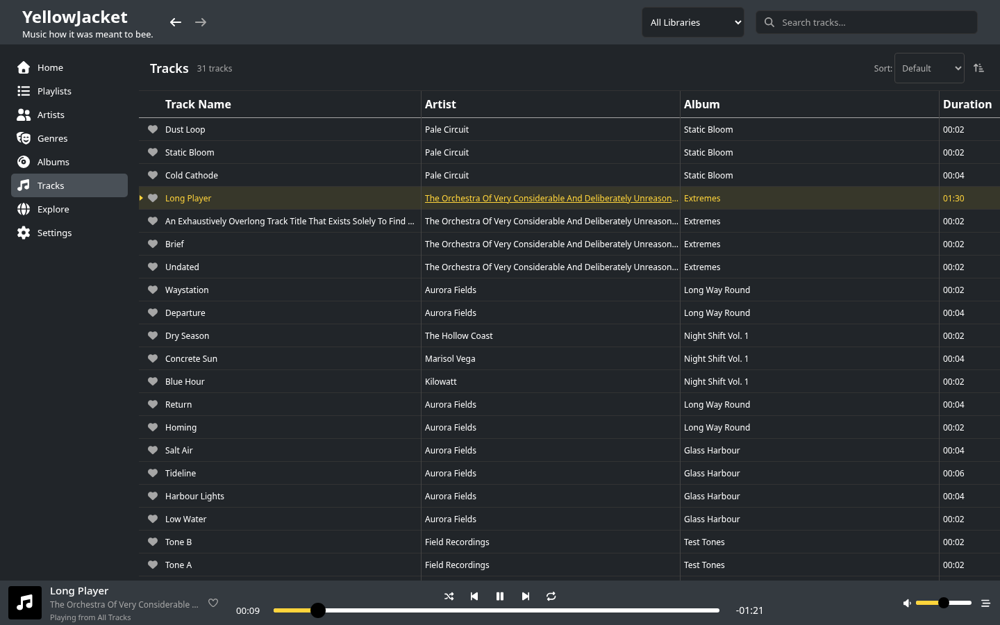
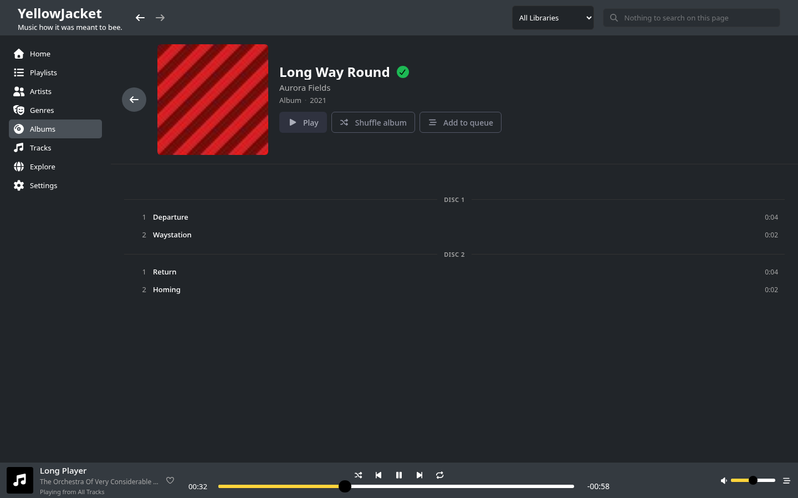
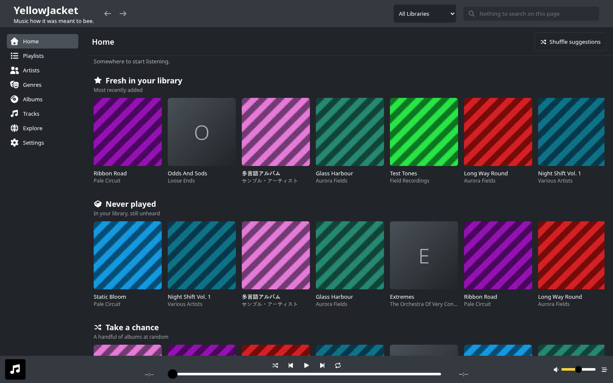

# YellowJacket

*Music how it was meant to bee.*

YellowJacket plays the music you already own. Point it at your folders and it
scans them, reads the tags and the cover art, and gives you a library you can
browse, search, queue and tidy up — on your own machine, with no account, no
streaming service and no telemetry.

It plays **MP3**, **FLAC**, **OGG Vorbis** and **WAV**, on **Linux** and
**Android**, and builds from source on **macOS**.



## What it does

**Plays your files.** Play, pause, seek and volume with a mute toggle; a
read-ahead buffer so seeking is instant rather than gappy; a queue you can add
to, reorder and shuffle, with play-next; shuffle and repeat (off / all / one).
It remembers the track, the position and the queue between sessions, and it
answers your desktop's media keys — MPRIS on Linux, a media notification and
lock-screen controls on Android.

**Keeps the library tidy.** It scans the folders you give it and rescans only
what changed, so a big library costs its full scan once. It de-duplicates
embedded cover art rather than storing the same image a hundred times, notices
files that have gone away, and spots duplicate tracks. Browse by album, artist
or genre, search across everything, mark favourites, and see what you have been
playing.

**Playlists, and playlists that write themselves.** Drag tracks in and reorder
them, or describe what you want — genre, play count, how long since you played
it — and let a smart playlist keep itself up to date.

**Explore and auto-tag, from the MusicBrainz catalog.** Explore browses artists,
releases and genres from the catalog rather than only from what you own, so an
album page can tell you that you have nine of its twelve tracks. Auto-tag
matches your files against MusicBrainz and fills in the metadata that is
missing, with a review step before anything is written to disk. Lyrics search
finds a track from a line you remember.

Explore needs its catalog, which is a one-off ~0.6 GB download from
**Settings → Search Index**. It asks first on a metered connection, and
everything else in the app works without it.

## Install

Every download comes from the
[releases page](https://git.ljones.me/yonlu/yellowjacket/releases).

### Linux

Download `yellowjacket-<version>-linux-amd64.tar.gz` from the latest release and
unpack it. It holds the binary, a `.desktop` entry and an icon.

On **Arch**, install it from the package registry instead and get updates with
the rest of your system — the one-time key import and `pacman.conf` block are in
[`packaging/arch/README.md`](packaging/arch/README.md):

```bash
sudo pacman -Sy yellowjacket
```

### Android

Install the APK from the release page, or from the URL below, which always
points at the newest build:

```
https://git.ljones.me/api/packages/yonlu/generic/yellowjacket-android/latest/yellowjacket.apk
```

That URL needs no credentials, so [Obtainium](https://obtainium.imranr.dev/) can
poll it directly and keep the app up to date. The build is `arm64-v8a` only, and
[`docs/android-release.md`](docs/android-release.md) says why.

### macOS

Homebrew builds it from source on your own Mac — there is no prebuilt `.app`,
because a signed macOS bundle needs a macOS machine to produce it and the
release runner is a Linux container.

```bash
brew install shadow-puppet/yellowjacket/yellowjacket
```

See [`packaging/homebrew/README.md`](packaging/homebrew/README.md).

### Windows

Not published. It cross-compiles cleanly, but no Windows build of this app has
ever been *run*, and nothing here can exercise one — so shipping it would be a
promise that cannot be kept. You can still build it yourself: see
[`CONTRIBUTING.md`](CONTRIBUTING.md).

### Coming from a 1.x install?

Versions restarted at **0.0.1** when releases became automatic, which every
package manager reads as a downgrade. It costs one reinstall, once — the details
are with each channel: [Homebrew](packaging/homebrew/README.md#upgrading-from-1x-needs-a-reinstall-once),
[Android](docs/android-release.md#the-1x-installs-cannot-be-upgraded-to-00x).

## First run

1. Launch YellowJacket.
2. Add the folder your music lives in — the first-run wizard asks, and
   **Settings → Libraries** is where you add more later.
3. Watch the scan finish. It reports progress, and you can browse while it runs.
4. Queue something and press play.

Your library and settings stay on your machine:

| | Linux / macOS | Windows |
|---|---|---|
| Config | `~/.config/yellowjacket/` | `%LOCALAPPDATA%\yellowjacket\config` |
| Library data | `~/.local/share/yellowjacket/` | `%LOCALAPPDATA%\yellowjacket\data` |

Setting `YJ_HOME` moves both, which is how you keep a second library separate.

## More screenshots

An album page knows what you own, and says so:



The home page suggests somewhere to start rather than opening on a wall of
everything:



## Contributing, and the rest of the documentation

- [`CONTRIBUTING.md`](CONTRIBUTING.md) — build it from source, run the tests,
  and how a change gets in.
- [`CLAUDE.md`](CLAUDE.md) — the deep reference: the architecture and the reasons
  behind the shape of it.
- [The issue tracker](https://git.ljones.me/yonlu/yellowjacket/issues) is what
  is wanted and what is being worked on; **#73** is the roadmap.
- [Releases](https://git.ljones.me/yonlu/yellowjacket/releases) double as the
  changelog — every one is generated from the commits it contains.
